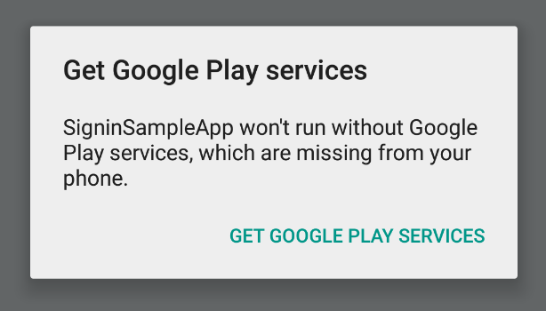

<p align="center">
  <a href="https://www.npmjs.com/package/react-native-google-signin"></a>
</p>

## Features

- Support all 3 types of authentication methods (standard, with server-side validation or with offline access (aka server side access))
- Promise-based API consistent between Android and iOS
- Typings for TypeScript and Flow
- Native signin buttons

## Project setup and initialization

`yarn add react-native-google-signin`

Then follow the [Android guide](docs/android-guide.md) and [iOS guide](docs/ios-guide.md)

## Public API

### 1. GoogleSigninButton


```js
import { GoogleSignin, GoogleSigninButton } from 'react-native-google-signin';

render() {
  <GoogleSigninButton
    style={{ width: 192, height: 48 }}
    size={GoogleSigninButton.Size.Wide}
    color={GoogleSigninButton.Color.Dark}
    onPress={this._signIn}
    disabled={this.state.isSigninInProgress} />
}
```

#### Props

##### `size`

Possible values:

- Size.Icon: display only Google icon. Recommended size of 48 x 48.
- Size.Standard: icon with 'Sign in'. Recommended size of 230 x 48.
- Size.Wide: icon with 'Sign in with Google'. Recommended size of 312 x 48.

Default: `Size.Standard`. Given the `size` prop you pass, we'll automatically apply the recommended size, but you can override it by passing the style prop as in `style={{ width, height }}`.

##### `color`

Possible values:

- Color.Dark: apply a blue background
- Color.Light: apply a light gray background

##### `disabled`

Boolean. If true, all interactions for the button are disabled.

##### `onPress`

Handler to be called when the user taps the button

##### [Inherited `View` props...](https://facebook.github.io/react-native/docs/view#props)

### 2. GoogleSignin

```js
import { GoogleSignin, GoogleSigninButton, statusCodes } from 'react-native-google-signin';
```

#### `configure(options)`

It is mandatory to call this method before attempting to call `signIn()` and `signInSilently()`. This method is sync meaning you can call `signIn` / `signInSilently` right after it. In typical scenarios, `configure` needs to be called only once, after your app starts. In the native layer, this is a synchronous call.

Example usage with for default options: you get user email and basic profile info.

```js
import { GoogleSignin } from 'react-native-google-signin';

GoogleSignin.configure();
```

Example to access Google Drive both from the mobile application and from the backend server

```js
GoogleSignin.configure({
  scopes: ['https://www.googleapis.com/auth/drive.readonly'], // what API you want to access on behalf of the user, default is email and profile
  webClientId: '<FROM DEVELOPER CONSOLE>', // client ID of type WEB for your server (needed to verify user ID and offline access)
  offlineAccess: true, // if you want to access Google API on behalf of the user FROM YOUR SERVER
  hostedDomain: '', // specifies a hosted domain restriction
  loginHint: '', // [iOS] The user's ID, or email address, to be prefilled in the authentication UI if possible. [See docs here](https://developers.google.com/identity/sign-in/ios/api/interface_g_i_d_sign_in.html#a0a68c7504c31ab0b728432565f6e33fd)
  forceConsentPrompt: true, // [Android] if you want to show the authorization prompt at each login.
  accountName: '', // [Android] specifies an account name on the device that should be used
  iosClientId: '<FROM DEVELOPER CONSOLE>', // [iOS] optional, if you want to specify the client ID of type iOS (otherwise, it is taken from GoogleService-Info.plist)
});
```

#### `signIn()`

Prompts a modal to let the user sign in into your application. Resolved promise returns an [`userInfo` object](#3-userinfo).

```js
// import statusCodes along with GoogleSignin
import { GoogleSignin, statusCodes } from 'react-native-google-signin';

// Somewhere in your code
signIn = async () => {
  try {
    await GoogleSignin.hasPlayServices();
    const userInfo = await GoogleSignin.signIn();
    this.setState({ userInfo });
  } catch (error) {
    if (error.code === statusCodes.SIGN_IN_CANCELLED) {
      // user cancelled the login flow
    } else if (error.code === statusCodes.IN_PROGRESS) {
      // operation (f.e. sign in) is in progress already
    } else if (error.code === statusCodes.PLAY_SERVICES_NOT_AVAILABLE) {
      // play services not available or outdated
    } else {
      // some other error happened
    }
  }
};
```

#### `signInSilently()`

May be called eg. in the `componentDidMount` of your main component. This method returns the [current user](#3-userinfo) and rejects with an error otherwise.

To see how to handle errors read [`signIn()` method](#signin)

```js
getCurrentUserInfo = async () => {
  try {
    const userInfo = await GoogleSignin.signInSilently();
    this.setState({ userInfo });
  } catch (error) {
    if (error.code === statusCodes.SIGN_IN_REQUIRED) {
      // user has not signed in yet
    } else {
      // some other error
    }
  }
};
```

#### `isSignedIn()`

This method may be used to find out whether some user is currently signed in. It returns a promise which resolves with a boolean value (it never rejects). In the native layer, this is a synchronous call. This means that it will resolve even when the device is offline. Note that it may happen that `isSignedIn()` resolves to true and calling `signInSilently()` rejects with an error (eg. due to a network issue).

```js
isSignedIn = async () => {
  const isSignedIn = await GoogleSignin.isSignedIn();
  this.setState({ isLoginScreenPresented: !isSignedIn });
};
```

#### `getCurrentUser()`

This method resolves with `null` or `userInfo` object. The call never rejects and in the native layer, this is a synchronous call. Note that on Android, `accessToken` is always `null` in the response.

```js
getCurrentUser = async () => {
  const currentUser = await GoogleSignin.getCurrentUser();
  this.setState({ currentUser });
};
```

#### `clearCachedToken(tokenString)`

This method only has an effect on Android (Calling this method always resolves on iOS.). You may run into a 401 Unauthorized error when a token is invalid. Call this method to remove the token from local cache and then call `getTokens()` to get fresh tokens.

#### `getTokens()`

Resolves with an object containing `{ idToken: string, accessToken: string, }` or rejects with an error. Note that using `accessToken` is [discouraged](https://developers.google.com/identity/sign-in/android/migration-guide).

#### `signOut()`

Remove user session from the device.

```js
signOut = async () => {
  try {
    await GoogleSignin.revokeAccess();
    await GoogleSignin.signOut();
    this.setState({ user: null }); // Remember to remove the user from your app's state as well
  } catch (error) {
    console.error(error);
  }
};
```

#### `revokeAccess()`

Remove your application from the user authorized applications.

```js
revokeAccess = async () => {
  try {
    await GoogleSignin.revokeAccess();
    console.log('deleted');
  } catch (error) {
    console.error(error);
  }
};
```

#### `hasPlayServices(options)`

Check if device has Google Play Services installed. Always resolves to true on iOS.

Presence of up-to-date Google Play Services is required to show the sign in modal, but it is _not_ required to perform calls to `configure` and `signInSilently`. Therefore, we recommend to call `hasPlayServices` directly before `signIn`.

```js
try {
  await GoogleSignin.hasPlayServices({ showPlayServicesUpdateDialog: true });
  // google services are available
} catch (err) {
  console.error('play services are not available');
}
```

`hasPlayServices` accepts one parameter, an object which contains a single key: `showPlayServicesUpdateDialog` (defaults to `true`). When `showPlayServicesUpdateDialog` is set to true the library will prompt the user to take action to solve the issue, as seen in the figure below.

You may also use this call at any time to find out if Google Play Services are available and react to the result as necessary.

[](#prompt-install)

#### `statusCodes`

These are useful when determining which kind of error has occured during sign in process. Import `statusCodes` along with `GoogleSignIn`. Under the hood these constants are derived from native GoogleSignIn error codes and are platform specific. Always prefer to compare `error.code` to `statusCodes.SIGN_IN_CANCELLED` or `statusCodes.IN_PROGRESS` and not relying on raw value of the `error.code`.

| Name                          | Description                                                                                                   |
| ----------------------------- | ------------------------------------------------------------------------------------------------------------- |
| `SIGN_IN_CANCELLED`           | When user cancels the sign in flow                                                                            |
| `IN_PROGRESS`                 | Trying to invoke another sign in flow (or any of the other operations) when previous one has not yet finished |
| `SIGN_IN_REQUIRED`            | Useful for use with `signInSilently()` - no user has signed in yet                                            |
| `PLAY_SERVICES_NOT_AVAILABLE` | Play services are not available or outdated, this can only happen on Android                                  |

[Example how to use `statusCodes`](#signin).

### 3. `userInfo`

Example `userInfo` which is returned after successful sign in.

```
{
  idToken: string,
  serverAuthCode: string,
  scopes: Array<string>, // on iOS this is empty array if no additional scopes are defined
  user: {
    email: string,
    id: string,
    givenName: string,
    familyName: string,
    photo: string, // url
    name: string // full name
  }
}
```

## Want to contribute?

Check out the [contributor guide](docs/CONTRIBUTING.md)!

## Notes

Calling the methods exposed by this package may involve remote network calls and you should thus take into account that such calls may take a long time to complete (eg. in case of poor network connection).

**idToken Note**: idToken is not null only if you specify a valid `webClientId`. `webClientId` corresponds to your server clientID on the developers console. It **HAS TO BE** of type **WEB**

Read [iOS documentation](https://developers.google.com/identity/sign-in/ios/backend-auth) and [Android documentation](https://developers.google.com/identity/sign-in/android/backend-auth) for more information

**serverAuthCode Note**: serverAuthCode is not null only if you specify a valid `webClientId` and set `offlineAccess` to true. once you get the auth code, you can send it to your backend server and exchange the code for an access token. Only with this freshly acquired token can you access user data.

Read [iOS documentation](https://developers.google.com/identity/sign-in/ios/offline-access) and [Android documentation](https://developers.google.com/identity/sign-in/android/offline-access) for more information.

## Additional scopes

The default requested scopes are `email` and `profile`.

If you want to manage other data from your application (for example access user agenda or upload a file to drive) you need to request additional permissions. This can be accomplished by adding the necessary scopes when configuring the GoogleSignin instance.

Please visit https://developers.google.com/identity/protocols/googlescopes or https://developers.google.com/oauthplayground/ for a list of available scopes.

## Troubleshooting

If you get a `SIGN_IN_REQUIRED` error code on Android from `signIn()`, make sure you've correctly setup the Google project including the SHA-1 of your debug and release keystores, and copied the new `google-services.json` in your project.

## Licence

(MIT)
