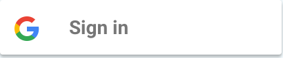

# react-native-google-sign

[](#demo)

## Features
- Support all 3 types of authentication methods (standard, with server-side validation or with offline access (aka server side access))
- Native signin button
- Consistent API between Android and iOS
- Promise-based JS API


## Installation

```bash
npm install react-native-google-signin --save
```

## Project setup and initialization

See [Android guide](android-guide.md) and [iOS guide](ios-guide.md)


## Public API

### GoogleSigninButton

[](#button)

```
import {GoogleSignin, GoogleSigninButton} from 'react-native-google-signin';

render() {

  <GoogleSigninButton
    style={{width: 48, height: 48}}
    size={GoogleSigninButton.Size.Icon}
    color={GoogleSigninButton.Color.Dark}
    onPress={this._signIn.bind(this)}/>
}
```

Possible value for ```size``` are:
- Size.Icon: display only Google icon. recommended size of 48 x 48
- Size.Standard: icon with 'Sign in'. recommended size of 230 x 48
- Size.Wide: icon with 'Sign in with Google'. recommended size of 312 x 48

Possible value for ```color``` are:
- Color.Dark: apply a blue background
- Color.Light: apply a light gray background


### GoogleSignin

#### configure
It is mandatory to call this method before any others.

Example for default configuration. you get user email and basic profile info.
```
import {GoogleSignin, GoogleSigninButton} from 'react-native-google-signin';

GoogleSignin.configure({
  iosClientId: <FROM DEVELOPPER CONSOLE>, // only for iOS
});
```

Example to access Google Drive both from the mobile application and from the backend server
```
GoogleSignin.configure({
  scopes: ["https://www.googleapis.com/auth/drive.readonly"], // what API you want to access on behalf of the user, default is email and profile
  iosClientId: <FROM DEVELOPPER CONSOLE>, // only for iOS
  webClientId: <FROM DEVELOPPER CONSOLE>, // client ID of type WEB for your server (needed to verify user ID and offline access)
  offlineAccess: true // if you want to access Google API on behalf of the user FROM YOUR SERVER
});

```

**iOS Note**: your app ClientID (```iosClientId```) is always required

#### currentUserAsync
Typically called on the ```componentDidMount``` of your main component. This method give you the current user if already login or null if not yet signin.

```
GoogleSignin.currentUserAsync().then((user) => {
      console.log('USER', user);
      this.setState({user: user});
    }).done();
```

#### currentUser
simple getter to access user once signed in.
```
const user = GoogleSignin.currentUser();
// user is null if not signed in
```

#### signIn
Prompt the modal to let the user signin into your application
```
GoogleSignin.signIn()
.then((user) => {
  console.log(user);
  this.setState({user: user});
})
.catch((err) => {
  console.log('WRONG SIGNIN', err);
})
.done();
```

**iOS Note**: an error with code ```-5``` is returned if the user cancels the signin process

#### signOut
remove user session from the device
```
GoogleSignin.signOut()
.then(() => {
  console.log('out');
})
.catch((err) => {

});
```

**iOS Note**: the signOut method does not return any event. you success callback will always be called.

#### revokeAccess
remove your application from the user authorized applications
```
GoogleSignin.revokeAccess()
.then(() => {
  console.log('deleted');
})
.catch((err) => {

})
```
### User

This is the typical information you obtain once the user sign in:
```
  {
    id: <user id. do not use on the backend>
    name: <user name>
    email: <user email>
    photo: <user picture profile>
    idToken: <token to authenticate the user on the backend>
    serverAuthCode: <one-time token to access Google API from the backend on behalf of the user>
    scopes: <list of authorized scopes>
    accessToken: <iOS only. needed to access google API from the application>
  }
```

**idToken Note**: idToken is not null only if you specify a valid ```webClientId```. ```webClientId``` corresponds to your server clientID on the developers console. It **HAS TO BE** of type **WEB**

Read [iOS documentation](https://developers.google.com/identity/sign-in/ios/backend-auth) and [Android documentation](https://developers.google.com/identity/sign-in/android/backend-auth) for more information

**serverAuthCode Note**: serverAuthCode is not null only if you specify a valid ```webClientId``` and set ```offlineAccess``` to true. once you get the auth code, you can send it to your backend server and exchange the code for an access token. Only with this freshly acquired token can you access user data.

Read [iOS documentation](https://developers.google.com/identity/sign-in/ios/offline-access) and [Android documentation](https://developers.google.com/identity/sign-in/android/offline-access) for more information

## Additional scopes

The default requested scopes are ```email``` and ```profile```.

If you want to manage other data from your application (for example access user agenda or upload a file to drive) you need to request additional permissions. This can be accomplished by adding the necessary scopes when configuring the GoogleSignin instance.

Please visit https://developers.google.com/oauthplayground/ for a list of available scopes.

## Licence
(MIT)
