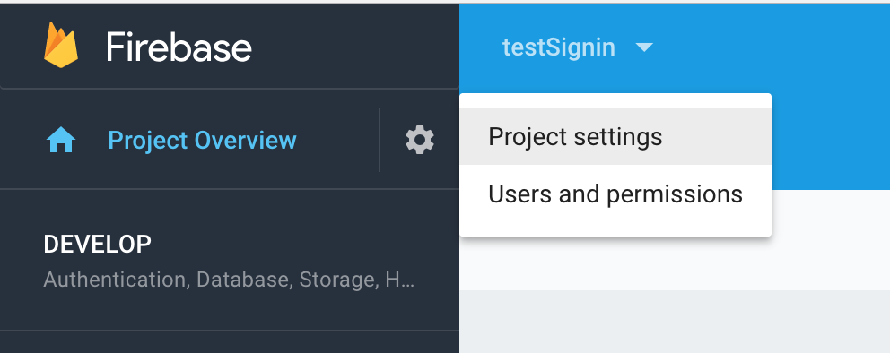

## Get configuration file

Please NOTE that you **do not** need firebase to get the necessary files and SHA1 hashes, but this tutorial is written assuming that you do have firebase. We currently do not have tutorial for the non-firebase approach, but you're welcome to create it!

If you don't already have a project in Firebase you need to create one in order to generate credentials for an iOS and Android application.

[Firebase console](https://console.firebase.google.com/u/0/)

1. Add your iOS and Android App inside Project settings (see image).

2. Enter required information and download the config file.

_Note: For Android, adding the SHA1 hash is an obligation_

You can use your debug keystore's SHA1 hash, read this [StackOverflow thread](https://stackoverflow.com/questions/15727912/sha-1-fingerprint-of-keystore-certificate) to obtain it. When running the `keytool` command, **MAKE SURE** you provide path to the correct keystore, you may have multiple keystores on your system! (eg in home directory, and also directly in the `android/app` folder). To see what keystore is being used to sign your app, go to `android/app/build.gradle` and look for `storeFile` entries.

If you don't have a keystore, you need to generate one. To generate your keystore follow [this guide](https://facebook.github.io/react-native/docs/signed-apk-android.html).

**IMPORTANT** if you have multiple keystores (and you likely do - eg. debug and release) you'll need to get the SHA1 hashes for all of them and save the hashes to Firebase!

## WebClientId

`webClientId` will be automatically generated once you create the app in the firebase console.
You can access the `webClientId` [here](https://console.developers.google.com/apis/credentials). Make sure you select the correct project. `webClientId` should be under OAuth section.
