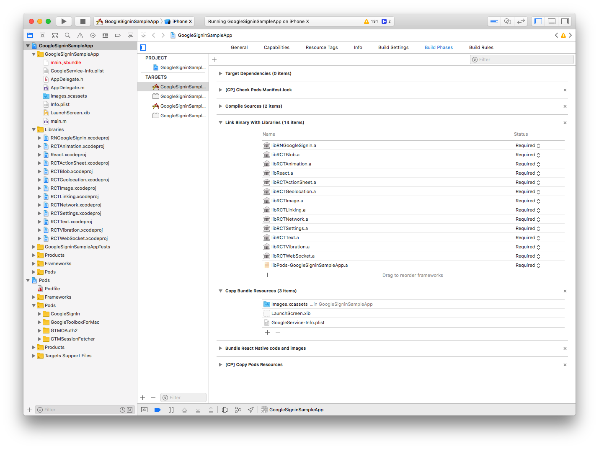
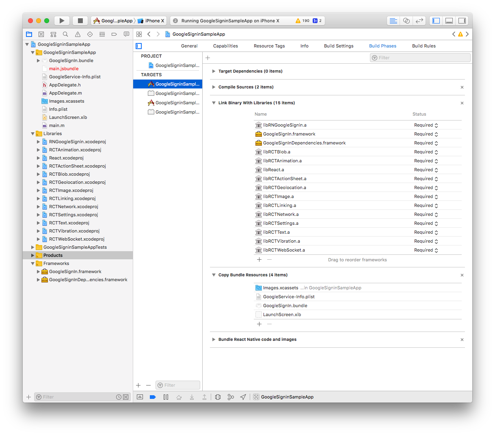
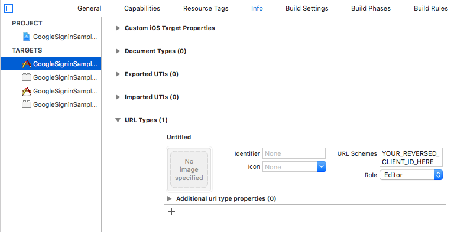

## iOS Guide

### 1. Installation

NOTE for RN < 0.60 `react-native-link` may add the `RNGoogleSignin` podspec to your Podfile. If your Podfile looks roughly like the one described [here](http://facebook.github.io/react-native/docs/integration-with-existing-apps#configuring-cocoapods-dependencies) then this is likely what you want, but otherwise you may get stuck with build errors. If your Podfile does not refer to the `React` podspec, then you probably do not want to use the `RNGoogleSignin` podspec and we recommend that you rename or delete the `RNGoogleSignin.podspec` file from `node_modules/react-native-google-signin` and only then run `react-native link react-native-google-signin`. This is a one-time operation that you won't need to repeat later.

#### Link the native module

You can link the module automatically or manually

##### automatic linking

- in RN >= 0.60 run `pod install` in `ios/` directory to install the module

- in RN < 0.60 run `react-native link react-native-google-signin`

##### manual linking

1. In Xcode, in the project navigator, right click Libraries ➜ Add Files to [your project's name]
2. Go to `node_modules` ➜ `react-native-google-signin` ➜ `ios` and add `RNGoogleSignin.xcodeproj`
3. In Xcode, in the project navigator, select your project. Add `libRNGoogleSignin.a` to your project's Build Phases ➜ Link Binary With Libraries

#### Install Google Sign In SDK

Again, we offer two ways to do this: with and without Cocoapods. Note that we require Google Sign In SDK version >= 5.0.0!

##### With Cocoapods

1. install the Google Signin SDK with [CocoaPods](https://cocoapods.org/): add `pod 'GoogleSignIn', '~> 5.0.0'` in your Podfile and run `pod install`

First time using cocoapods ? [check this out](./how-cocoapods.md)

At the end, the dependencis should be linked like in this picture (this is _with_ pods).

[](../img/buildPhasesWithPods.png?raw=true)

#### Without Cocoapods

1. download the GoogleSignIn SDK from [here](https://developers.google.com/identity/sign-in/ios/sdk/) and unzip it. Drag and drop the unzipped `.framework` files into the `Frameworks` group in Xcode and copy `GoogleSignIn.bundle` to your project. During copying, check `copy items if needed`.
2. make sure `GoogleSignIn.bundle` is added in your Xcode project's Copy Bundle Resources build phase.

**NOTE** according to [google sign in docs](https://developers.google.com/identity/sign-in/ios/sdk/) you may also need to do this: In <your target> -> Build Phases -> `Link binary with libraries` step, add `libRNGoogleSignin.a`, `AddressBook.framework`, `SafariServices.framework`, `SystemConfiguration.framework` and `libz.tbd`. We have found it not to be necessary for a successful build, but we recommend to follow Google's installation instructions!

At the end, the dependencis should be linked like in this picture (this is _without_ pods).

[](../img/buildPhasesWithoutPods.png?raw=true)

### 2. Google project configuration

- Follow [this](./get-config-file.md) guide to get the configuration file.

- Download the `GoogleService-Info.plist` file at the end of the process

### 3. Xcode configuration

- Configure URL types in the `Info` panel (see screenshot)
  - add a URL with scheme set to your `REVERSED_CLIENT_ID` (found inside `GoogleService-Info.plist`)

[](../img/urlTypes.png?raw=true)

### Modify your app to respond to the URL scheme (optional)

This is only required if you have multiple listeners for `openURL` - for instance if you have both Google and Facebook OAuth.

Because only one `openURL` method can be defined, if you have multiple listeners for `openURL`, you must combine them into a single function in your `AppDelegate.m` like so:

- Open `AppDelegate.m`
- Add an import: `#import <RNGoogleSignin/RNGoogleSignin.h>` (if this one will not work try `#import "RNGoogleSignin.h"`). If this file cannot be found, you need to modify your header search paths so Xcode can find headers of `react-native-google-signin`. For example, when using the non-cocoapods installation, make sure that `$(SRCROOT)/../node_modules/react-native-google-signin/ios` is included in your target's header search paths.
- Add a method to respond to the URL scheme:

```objc
// AppDelegate.m
- (BOOL)application:(UIApplication *)application openURL:(nonnull NSURL *)url options:(nonnull NSDictionary<NSString *,id> *)options {
  return [[FBSDKApplicationDelegate sharedInstance] application:application openURL:url options:options] || [RNGoogleSignin application:application openURL:url options:options];
}
```
