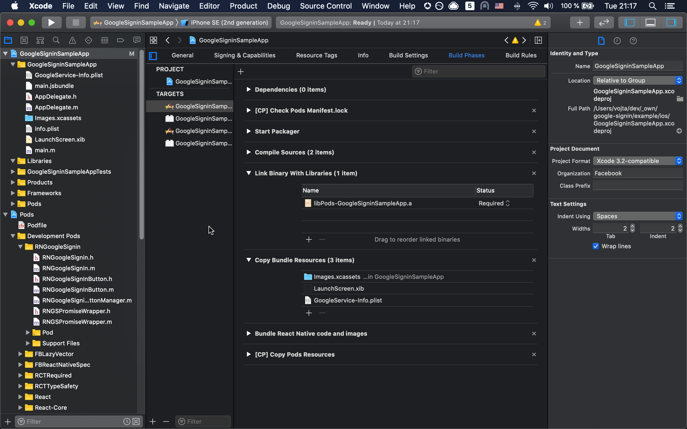

## iOS Guide

### 1. Installation

#### Link the native module

- run `pod install` in `ios/` directory to install the module

#### Install Google Sign In SDK

The [podspec](https://github.com/react-native-google-signin/google-signin/blob/master/RNGoogleSignin.podspec) will install a compatible version of the [GoogleSignIn pod](https://github.com/react-native-google-signin/google-signin/blob/master/RNGoogleSignin.podspec). All you need to do is run `pod install` and then recompile the iOS project.

First time using cocoapods? [check this out](./how-cocoapods.md)

At the end, the dependencis should be linked like in this picture (this is _with_ pods, for RN >= 0.60).

[](../img/buildPhasesWithPods.png?raw=true)

### 2. Google project configuration

- Follow [this](./get-config-file.md) guide to get the configuration file.

- Download the `GoogleService-Info.plist` file at the end of the process

### 3. Xcode configuration

- Configure URL types in the `Info` panel (see screenshot)
  - add a URL with scheme set to your `REVERSED_CLIENT_ID` (found inside `GoogleService-Info.plist`)
- If you need to support Mac Catalyst, you will need to enable the Keychain Sharing capability on each build target. No keychain groups need to be added.

[](../img/urlTypes.png?raw=true)

### Optional: modify your app to respond to the URL scheme

This is only required if you have multiple listeners for `openURL` - for instance if you have both Google and Facebook OAuth (as seen in the code snippet below).

Because only one `openURL` method can be defined, if you have multiple listeners for `openURL`, you must combine them into a single function in your `AppDelegate.m` like so:

- Open `AppDelegate.m`
- Add an import: `#import <RNGoogleSignin/RNGoogleSignin.h>` (if this one will not work try `#import "RNGoogleSignin.h"`). If this file cannot be found, you need to modify your header search paths so Xcode can find headers of `react-native-google-signin`. For example, when using the non-cocoapods installation, make sure that `$(SRCROOT)/../node_modules/@react-native-google-signin/google-signin/ios` is included in your target's header search paths.
- Add a method to respond to the URL scheme. This is just an example of a method that you can add at the bottom of your file if you're using both `FBSDKApplicationDelegate` and `RNGoogleSignin` :

```objc
// AppDelegate.m
- (BOOL)application:(UIApplication *)application openURL:(nonnull NSURL *)url options:(nonnull NSDictionary<NSString *,id> *)options {
  return [[FBSDKApplicationDelegate sharedInstance] application:application openURL:url options:options] || [RNGoogleSignin application:application openURL:url options:options];
}
```

## FAQ / Troubleshooting

#### I'm getting an error and I'm not able to fix it

Configuring google sign in can sometimes be tricky. If you're hitting a wall, you can get in touch with a maintainer ([@vonovak](https://github.com/vonovak)) via his [personal site](https://react-native-training.eu/). Please note that this is a paid service.

#### On iOS the app crashes when tapping Sign In button

You're most likely missing `Url Schemes` configuration. How to do it: 
